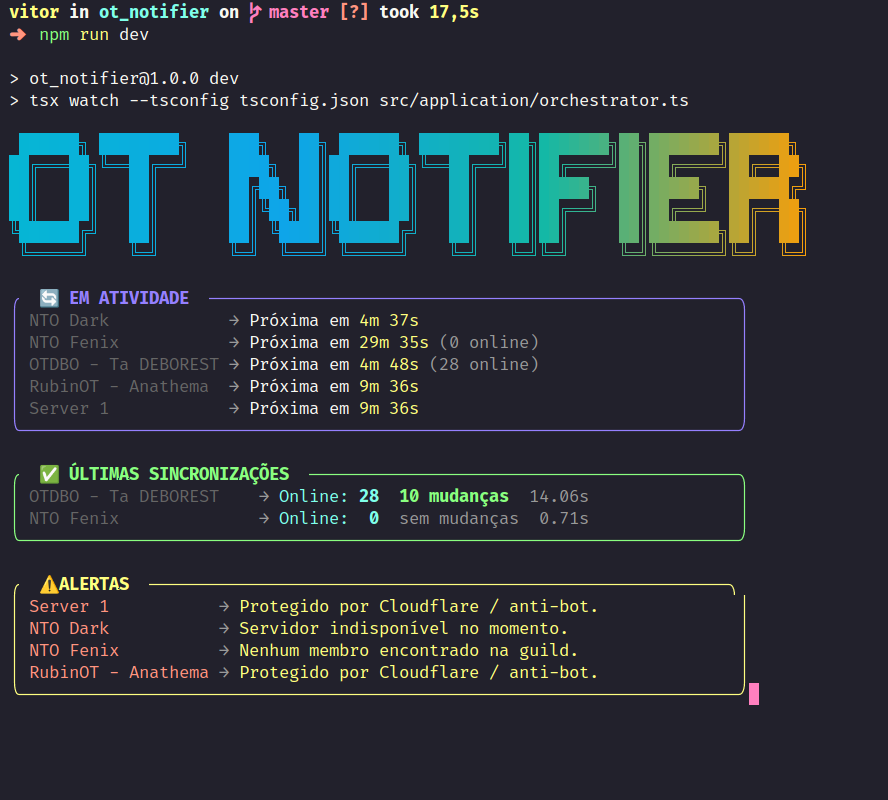

<h1 align="center">
  ⚔️ OT Notifier
</h1>

<p align="center">
  
  
  
  
  
  
</p>

<p align="center">
  Monitor de guilds e personagens para servidores de <strong>Open Tibia</strong> com notificações em tempo real via Discord.
</p>

<p align="center">
  
</p>

---

## 📚 Sobre o projeto

OT Notifier é um sistema de monitoramento multi-servidor para Open Tibia. Ele acompanha membros de guilds, detecta mudanças de nível (up/down) e mortes de personagens, enviando notificações automáticas via webhook do Discord.

| Funcionalidade | Detalhe |
|----------------|---------|
| **Monitoramento de guild** | Scraping periódico dos membros da guild |
| **Level up / down** | Detecta subidas e descidas de nível com streak |
| **Mortes** | Notifica mortes com matadores e nível perdido |
| **Anti-bot** | Detecção de Cloudflare |
| **Rate limiting** | Controle de requisições por servidor (Bottleneck) |
| **Cache de personagens** | Cache LRU com TTL configurável para reduzir scraping |
| **CLI interativa** | Gerenciamento completo de servidores via terminal |
| **Multi-servidor** | Cada servidor roda em processo worker isolado |
| **Docker** | Suporte nativo com volumes persistentes |

---

## 💻 Pré-requisitos

- [Node.js](https://nodejs.org/) v22+
- [npm](https://www.npmjs.com/), [pnpm](https://pnpm.io/) ou [yarn](https://yarnpkg.com/)

---

## 🚀 Como executar

```bash
# Clone o repositório
$ git clone https://github.com/VitorFirmino/ot_notifier.git
$ cd ot_notifier

# Instale as dependências
$ npm install

# (Opcional) Configure variáveis de ambiente
$ cp .env.example .env
```

### Gerenciar servidores via CLI

```bash
$ npm run manage
```

Acesso ao menu interativo para adicionar, configurar e testar servidores e webhooks.

### Iniciar o monitoramento

```bash
# Produção
$ npm run start

# Desenvolvimento (com hot-reload)
$ npm run dev
```

---

## 🐳 Docker

```bash
# Subir com Docker Compose
$ docker compose up --build -d

# Gerenciar servidores dentro do container
$ docker compose exec ot_notifier npm run manage

# Ver logs
$ docker compose logs -f
```

Os dados dos servidores são persistidos em volumes Docker — ao remover e recriar o container os estados são mantidos.

---

## ⚙️ Configuração

### servers.json

Adicione servidores manualmente ou via CLI:

```json
[
  {
    "id": "meu_servidor",
    "name": "Meu Servidor",
    "url": "https://meuservidor.com/guilds/MinhaGuild",
    "enabled": true,
    "webhookUrl": "https://discord.com/api/webhooks/..."
  }
]
```

### Webhooks via variável de ambiente

Em vez de salvar o webhook no JSON, você pode defini-lo no `.env`.
O padrão é `WEBHOOK_URL_` + o `id` do servidor em **MAIÚSCULAS**:

```env
# servers.json → "id": "meu_servidor"
WEBHOOK_URL_MEU_SERVIDOR=https://discord.com/api/webhooks/ID/TOKEN

# servers.json → "id": "global_retro_pvp"
WEBHOOK_URL_GLOBAL_RETRO_PVP=https://discord.com/api/webhooks/ID/TOKEN

# Prefixo agrupado: aplica para todos os servidores cujo id começa com "global"
# Ex: global_retro_pvp, global_hardcore, global_optional — todos usam o mesmo webhook
WEBHOOK_URL_GLOBAL=https://discord.com/api/webhooks/ID/TOKEN
```

> O sistema tenta primeiro o match exato, depois o prefixo mais longo, e por último o webhook salvo no JSON.

### Configurações por servidor (`data/{id}.json`)

Cada servidor tem um arquivo de configuração individual com opções avançadas:

| Opção | Descrição | Padrão |
|-------|-----------|--------|
| `concurrency` | Requisições simultâneas | `3` |
| `requestDelay` | Delay entre requisições (ms) | `1000` |
| `checkInterval` | Intervalo de verificação (ms) | `120000` |
| `batchSize` | Tamanho do lote de personagens | `10` |

---

## 📁 Estrutura do Projeto

```
src/
├── application/
│   ├── managers/            # Ciclo de vida (render, shutdown, processos)
│   └── workers/
│       └── handlers/        # Lógica principal de verificação por servidor
├── cli/
│   └── index.ts             # CLI interativa (gerenciamento de servidores)
├── infrastructure/
│   ├── scraping/
│   │   ├── http/            # Axios client, rate limiter, Bottleneck
│   │   ├── parsers/         # Cheerio parsers (personagens, mortes)
│   │   └── utils/           # User-agent generator
│   └── storage/
│       ├── servers.json     # Lista de servidores monitorados
│       ├── data/            # Configuração individual por servidor
│       └── serverConfigManager.ts
└── shared/
    ├── errors/              # Hierarquia de erros tipados
    ├── types/               # Tipos globais (character, server, webhook)
    └── utils/               # Logger, cache, retry, timeout, blockRenderer
```

---

## 🔧 Scripts

| Comando | Descrição |
|---------|-----------|
| `npm run start` | Inicia o monitoramento |
| `npm run dev` | Modo desenvolvimento com hot-reload |
| `npm run manage` | Abre a CLI interativa |
| `npm run type-check` | Verificação de tipos TypeScript |
| `npm run lint` | Lint com ESLint |
| `npm run format` | Formata o código com Prettier |
| `npm run test` | Testes com Vitest |

---

## 🛠️ Tecnologias

- [Node.js 22](https://nodejs.org/) — Runtime
- [TypeScript 5](https://www.typescriptlang.org/) — Tipagem estática
- [tsx](https://github.com/privatenumber/tsx) — Execução direta de TypeScript
- [Axios](https://axios-http.com/) + [Cheerio](https://cheerio.js.org/) — HTTP e scraping HTML
- [Playwright](https://playwright.dev/) — Scraping de páginas com Cloudflare
- [Bottleneck](https://github.com/SGrondin/bottleneck) — Rate limiting robusto
- [Chalk](https://github.com/chalk/chalk) + [Boxen](https://github.com/sindresorhus/boxen) — UI de terminal
- [proper-lockfile](https://github.com/nicolo-ribaudo/proper-lockfile) — Locks atômicos para arquivos de estado
- [Vitest](https://vitest.dev/) — Testes unitários
- [Docker](https://www.docker.com/) — Containerização

---

## 📝 Licença

Este projeto está sob a licença ISC.

---

Feito por [Vitor Firmino](https://github.com/VitorFirmino)
